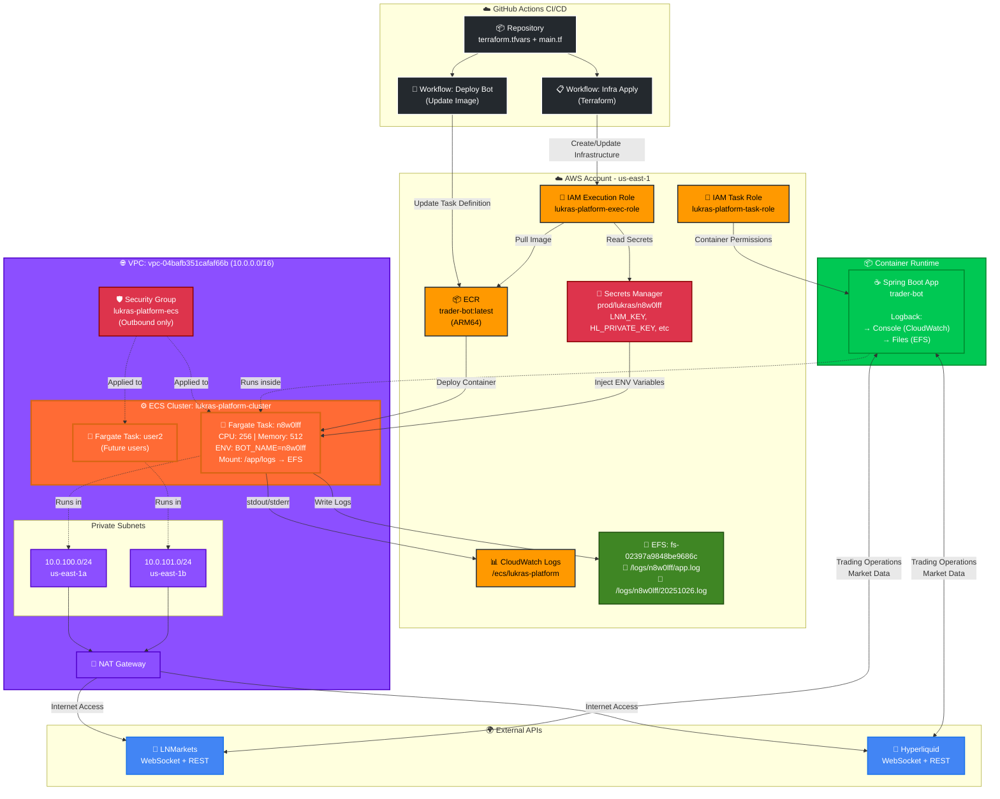

# Lukras Platform - Infra (Terraform)

Infraestrutura do ECS Fargate multi-bot (um Service por usuário), com:
- VPC, Subnets privadas, NAT, IGW
- EFS (logs persistentes), Access Point por usuário
- CloudWatch Logs
- (Opcional) ALB com regras por path `/usuario`
- Secrets do Secrets Manager em `prod/lukras/<usuario>`

# Lukras Platform

## 🏗️ Arquitetura

## 📋 Componentes

### CI/CD
- **GitHub Actions**: Automatiza deploy de infraestrutura (Terraform) e atualização de containers

### AWS Infrastructure
- **ECS Fargate**: Execução serverless de containers (ARM64)
- **ECR**: Registro privado de imagens Docker
- **EFS**: Armazenamento persistente para logs (rotação de 30 dias)
- **CloudWatch**: Monitoramento e logs em tempo real
- **Secrets Manager**: Gerenciamento seguro de credenciais por usuário

### Networking
- **VPC**: Isolamento de rede
- **Private Subnets**: Execução segura das tasks (sem IP público)
- **NAT Gateway**: Acesso controlado à internet
- **Security Groups**: Firewall com regras de saída apenas

### External Integrations
- **LNMarkets**: Trading de derivativos Bitcoin
- **Hyperliquid**: Trading DeFi perpétuo

## 🚀 Deploy

### Criar novo usuário
1. Adicionar usuário em `terraform.tfvars`
2. Criar secrets no AWS Secrets Manager: `prod/lukras/<user>`
3. Executar workflow "Infra Apply"
